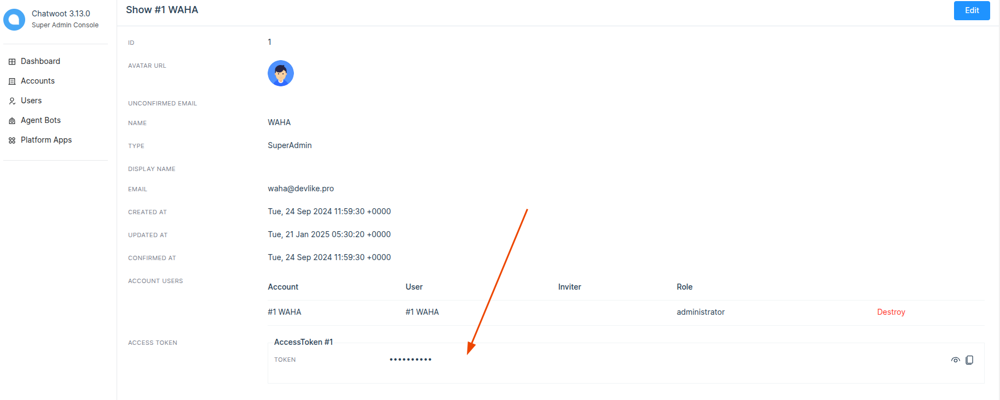
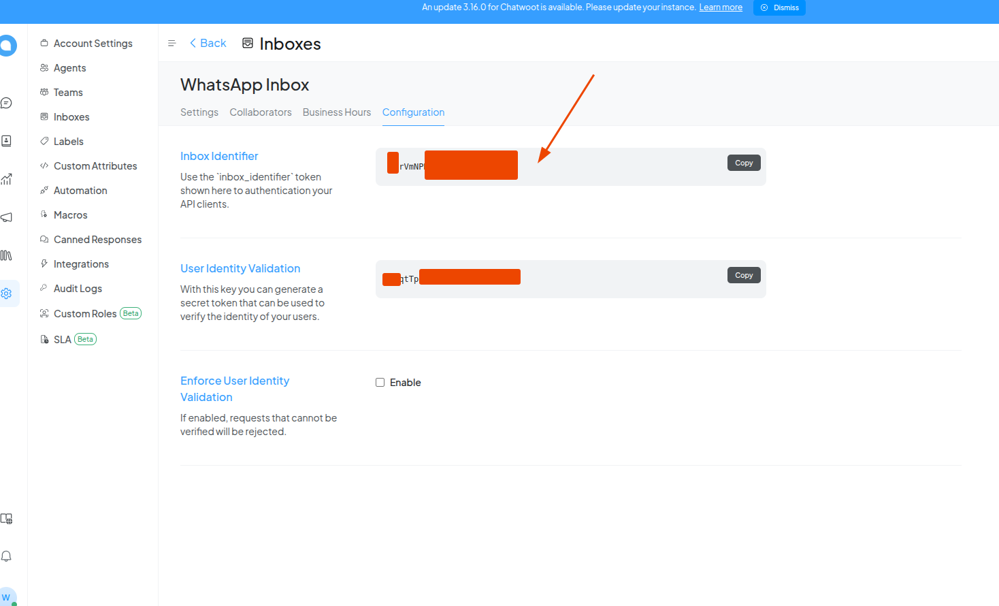

# @devlikeapro/n8n-nodes-chatwoot

<p align="center">
  
  
</p>

Automate your
[**ChatWoot**](https://www.chatwoot.com/)
workflows with
[**n8n**](https://n8n.io/)
!


[](https://www.npmjs.com/package/@devlikeapro/n8n-nodes-chatwoot)

- GitHub: [devlikeapro/n8n-nodes-chatwoot](http://github.com/devlikeapro/n8n-nodes-chatwoot)
- npm: [@devlikeapro/n8n-nodes-chatwoot](https://www.npmjs.com/package/@devlikeapro/n8n-nodes-chatwoot)
- ChatWoot API reference: [https://www.chatwoot.com/developers/api/](https://www.chatwoot.com/developers/api/)
- 👉 Generated from
  [ChatWoot OpenAPI](https://www.chatwoot.com/developers/api/)
  using [**devlikeapro/n8n-openapi-node**](https://github.com/devlikeapro/n8n-openapi-node)

# Tables of Contents

<!-- toc -->

- [Installation](#installation)
- [Usage](#usage)
  * [Credentials](#credentials)
    + [Platform](#platform)
    + [User](#user)
    + [Inbox](#inbox)

<!-- tocstop -->

# Installation
Install [the community node package in your n8n instance](https://docs.n8n.io/integrations/community-nodes/installation/gui-install/):
```
@devlikeapro/n8n-nodes-chatwoot
```

# Usage
1. Install the community package to your n8n instance.
2. Add **ChatWoot API** **credentials** in **n8n**.
3. Create a new workflow with the **ChatWoot** node.

## Credentials
There are few types of credentials (accounts) that you can use to authenticate with ChatWoot API.

For different ChatWoot API Endpoints you'll need different credentials - please
refer to the [ChatWoot API documentation](https://www.chatwoot.com/developers/api/) for more information.

We suggest you create **ChatWoot API** credentials in **n8n** for each type of account and name it `ChatWoot - {TYPE}` 
for better clarity.


### Platform
This token can be obtained by the system admin after creating a platformApp. This token should be used to provision agent bots, accounts, users and their roles.


### User
This token can be obtained by visiting the profile page or via rails console.


or **Super Admin** token in some cases



### Inbox
This token can be obtained by visiting the inbox settings page.




